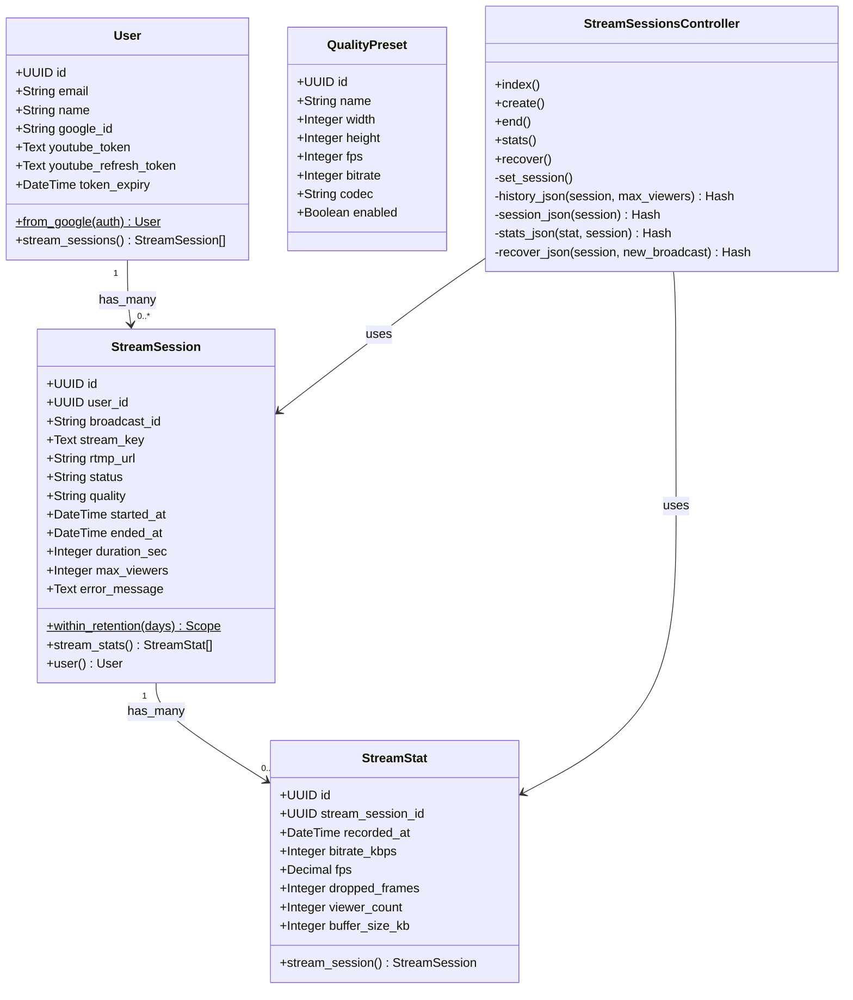
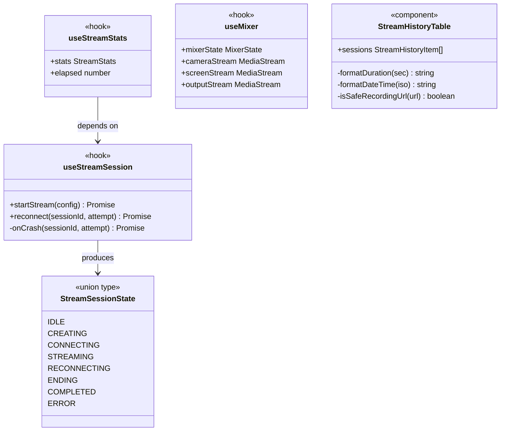

# クラス図（実装版）

## Rails API



## Go ブリッジ

```mermaid
classDiagram
    class FFmpegProcess {
        <<interface>>
        +Write(b []byte) int, error
        +Close() error
        +Done() chan struct{}
        +Stop()
    }

    class FFmpegRunner {
        <<interface>>
        +Start(params FFmpegParams) FFmpegProcess, error
    }

    class RealFFmpegRunner {
        -path string
        +Start(params FFmpegParams) FFmpegProcess, error
    }

    class FFmpegParams {
        +RTMPURL string
        +StreamKey string
        +BitrateKbps int
        +Resolution string
    }

    class Session {
        +ID string
        +RTMPURL string
        -mu sync.Mutex
        -stopFunc func()
        -writeChan chan []byte
        -adapter QualityAdapter
        -restartCh chan QualityParams
        +SetStopFunc(f func())
        +Stop()
        +SetWriteChan(ch chan []byte)
        +Adapt(fps, droppedFrames, bufferSizeKB, now) AdaptResult
        +CurrentBitrate() int
        +SendRestart(params QualityParams) bool
        +RecvRestart() QualityParams, bool
        +TrySendStats(data []byte) bool
    }

    class SessionStore {
        -mu sync.RWMutex
        -sessions map string Session
        +NewSessionStore() SessionStore
        +Register(id, rtmpURL string) error
        +Get(id string) Session, error
        +Delete(id string)
    }

    class QualityAdapter {
        -history []statsEntry
        -currentBitrate int
        -currentResolution string
        +NewQualityAdapter(bitrateKbps, resolution) QualityAdapter
        +CurrentBitrate() int
        +CurrentResolution() string
        +Adapt(fps, droppedFrames, bufferSizeKB, now) AdaptResult
        -dropRate(now) float64
        -trimHistory(now)
    }

    class AdaptResult {
        +Action string
        +NewBitrate int
        +NewResolution string
    }

    class Handler {
        -store SessionStore
        -runner FFmpegRunner
        +RegisterSession(c gin.Context)
        +StopSession(c gin.Context)
        +HandleWebSocket(c gin.Context)
        +PushStats(c gin.Context)
        -adaptQuality(sess Session, body []byte)
    }

    RealFFmpegRunner ..|> FFmpegRunner
    Handler --> SessionStore : uses
    Handler --> FFmpegRunner : uses
    SessionStore --> Session : manages
    Session --> QualityAdapter : contains
    QualityAdapter --> AdaptResult : returns
```

## Next.js フロントエンド（主要 hooks / types）


