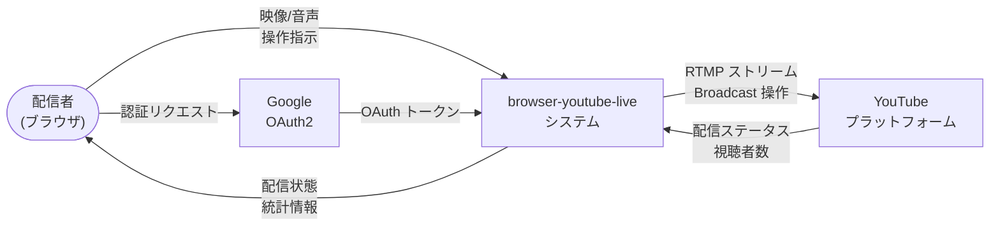
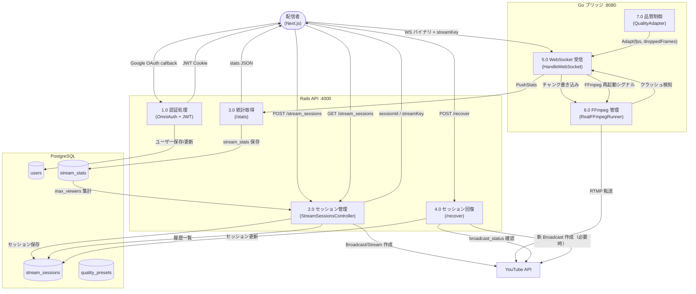

# DFD（データフロー図）実装版

実際の API エンドポイントとデータの流れをリバースエンジニアリングした図。

## レベル 0（コンテキスト図）

```mermaid
flowchart LR
    streamer(["配信者\n(ブラウザ)"])
    system["browser-youtube-live\nシステム"]
    youtube["YouTube\nプラットフォーム"]
    google["Google\nOAuth2"]

    streamer -- "映像/音声\n操作指示" --> system
    system -- "配信状態\n統計情報" --> streamer
    system -- "RTMP ストリーム\nBroadcast 操作" --> youtube
    youtube -- "配信ステータス\n視聴者数" --> system
    streamer -- "認証リクエスト" --> google
    google -- "OAuth トークン" --> system
```

## レベル 1（主要プロセス）

```mermaid
flowchart TD
    browser(["配信者\n(Next.js)"])

    subgraph rails["Rails API :4000"]
        P1["1.0 認証処理\n(OmniAuth + JWT)"]
        P2["2.0 セッション管理\n(StreamSessionsController)"]
        P3["3.0 統計取得\n(/stats)"]
        P4["4.0 セッション回復\n(/recover)"]
    end

    subgraph bridge["Go ブリッジ :8080"]
        P5["5.0 WebSocket 受信\n(HandleWebSocket)"]
        P6["6.0 FFmpeg 管理\n(RealFFmpegRunner)"]
        P7["7.0 品質制御\n(QualityAdapter)"]
    end

    subgraph db["PostgreSQL"]
        D1[("users")]
        D2[("stream_sessions")]
        D3[("stream_stats")]
        D4[("quality_presets")]
    end

    youtube["YouTube API"]

    browser -- "Google OAuth callback" --> P1
    P1 -- "ユーザー保存/更新" --> D1
    P1 -- "JWT Cookie" --> browser

    browser -- "POST /stream_sessions" --> P2
    P2 -- "Broadcast/Stream 作成" --> youtube
    P2 -- "セッション保存" --> D2
    P2 -- "sessionId / streamKey" --> browser

    browser -- "WS バイナリ + streamKey" --> P5
    P5 -- "チャンク書き込み" --> P6
    P6 -- "RTMP 転送" --> youtube
    P6 -- "クラッシュ検知" --> P5

    P5 -- "PushStats" --> P3
    P3 -- "stream_stats 保存" --> D3
    P3 -- "stats JSON" --> browser

    P7 -- "Adapt(fps, droppedFrames)" --> P5
    P5 -- "FFmpeg 再起動シグナル" --> P6

    browser -- "GET /stream_sessions" --> P2
    P2 -- "履歴一覧" --> D2
    D3 -- "max_viewers 集計" --> P2

    browser -- "POST /recover" --> P4
    P4 -- "broadcast_status 確認" --> youtube
    P4 -- "新 Broadcast 作成（必要時）" --> youtube
    P4 -- "セッション更新" --> D2
```
