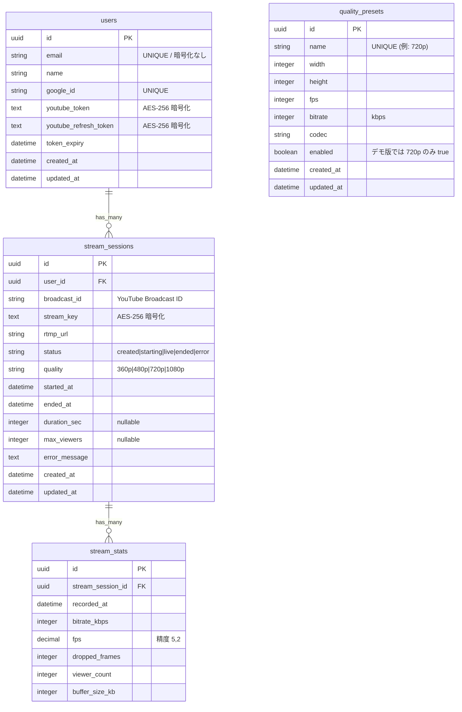

# ER図（実装版）

実際の `db/structure.sql` と Rails モデルをもとにリバースエンジニアリングした図。

## 備考

- `duration_sec` / `max_viewers` はスキーマ上はカラムとして存在するが、`GET /stream_sessions` の `history_json` では `ended_at - started_at` の計算値と `stream_stats` の集計値を返す。カラム値は現状 NULL のまま。
- `stream_key` は `ActiveRecord::Encryption` により AES-256 で暗号化して保存。
- `youtube_token` / `youtube_refresh_token` も同様に暗号化。
