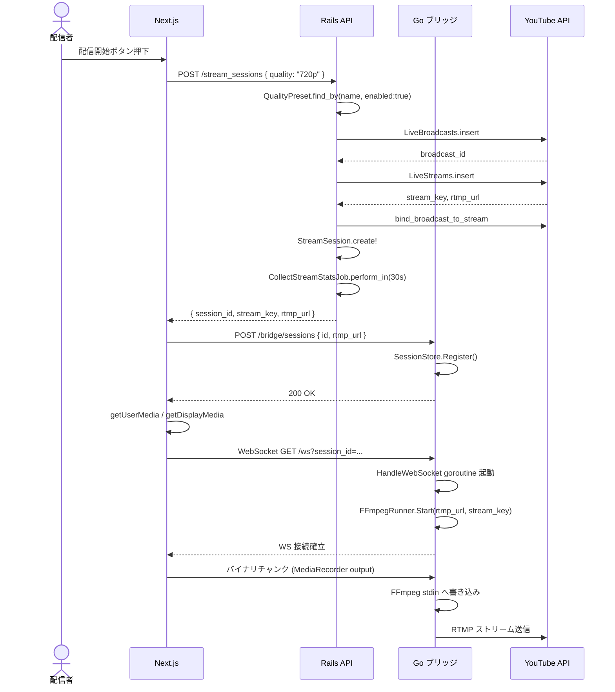
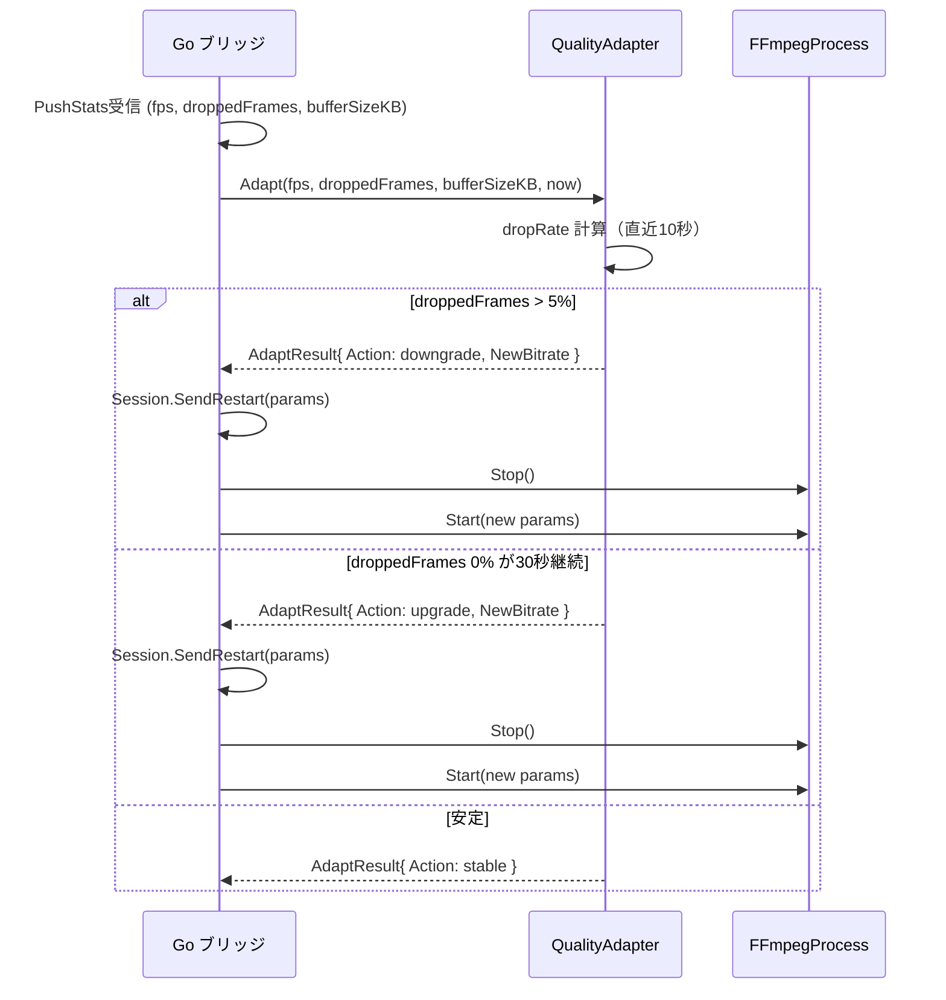
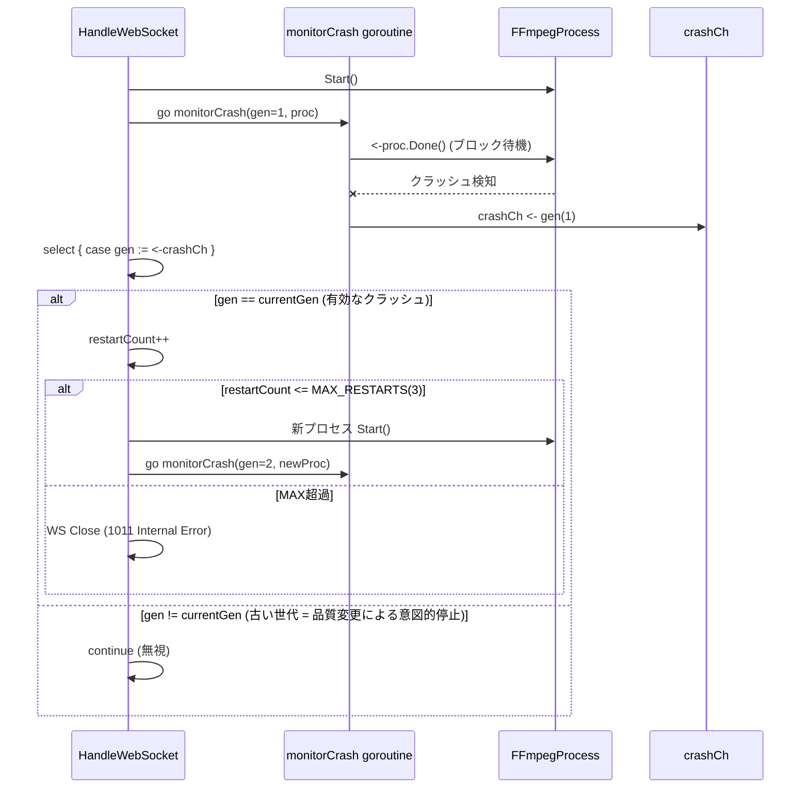
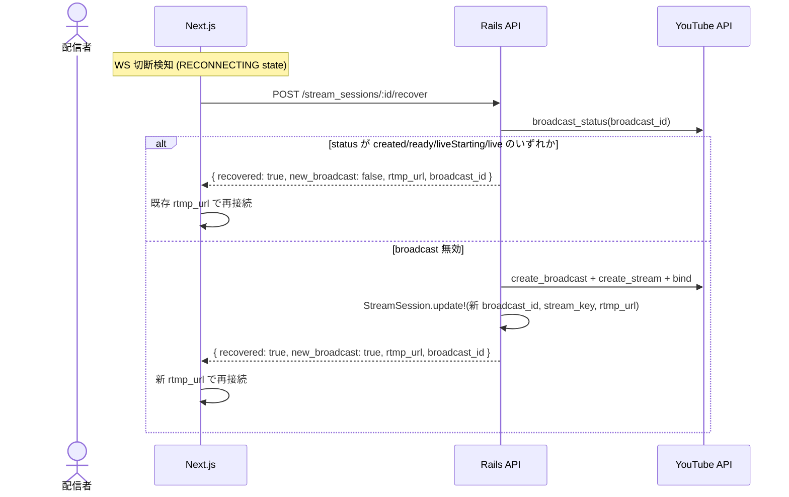
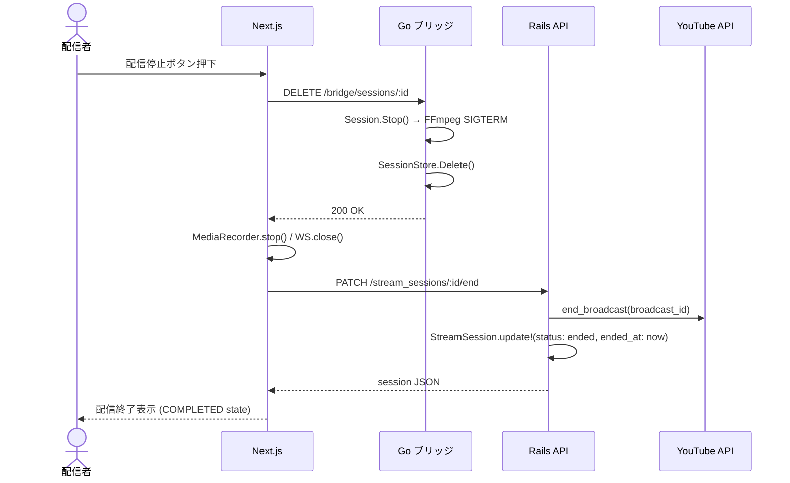

# シーケンス図（実装版）

## 1. 認証フロー（Google OAuth2）

```mermaid
sequenceDiagram
    actor User as 配信者
    participant FE as Next.js :3000
    participant Rails as Rails API :4000
    participant Google as Google OAuth2

    User->>FE: ログインボタン押下
    FE->>Google: リダイレクト /auth/google
    Google-->>Rails: GET /auth/google/callback?code=...
    Rails->>Google: トークン取得
    Google-->>Rails: access_token / refresh_token
    Rails->>Rails: User.from_google() 保存/更新
    Rails->>Rails: JwtService.encode(user_id)
    Rails-->>FE: Set-Cookie: jwt_token=<JWT> (SameSite=None; Secure)
    FE-->>User: ホーム画面表示
```

## 2. 配信開始フロー



## 3. 品質適応フロー



## 4. FFmpegクラッシュ自動再起動フロー



## 5. セッション回復フロー



## 6. 配信終了フロー


