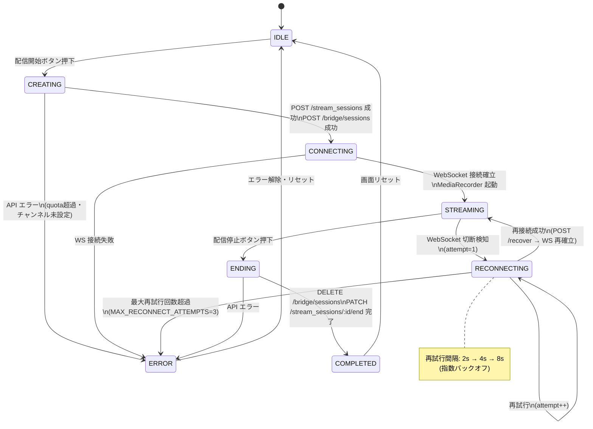
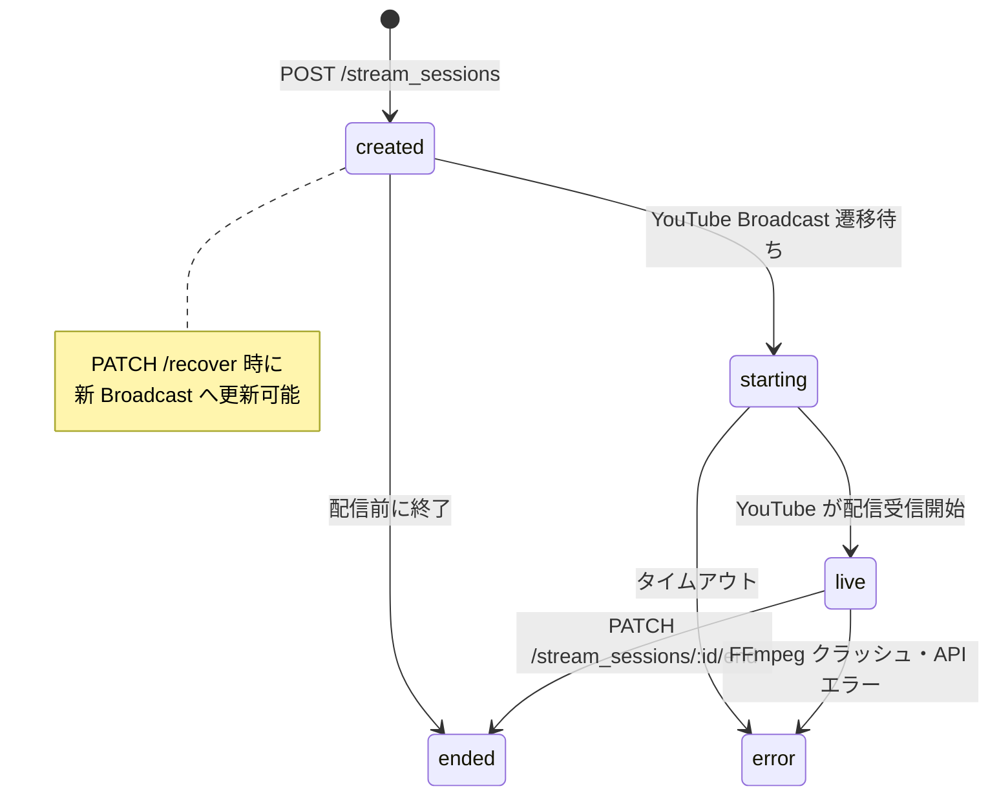
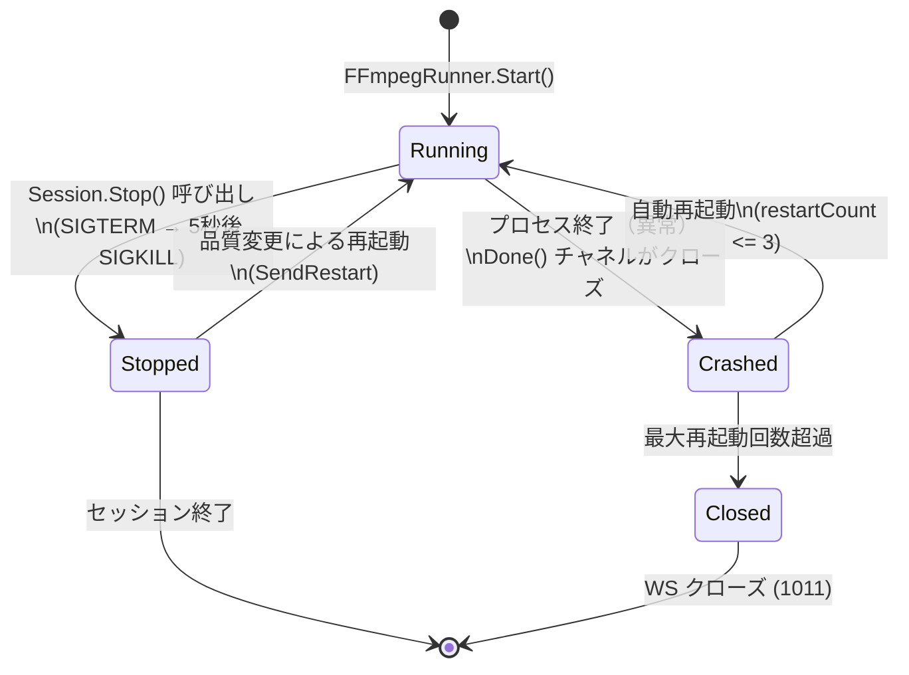

# 状態遷移図（実装版）

## フロントエンド配信状態（StreamSessionState）

`src/frontend/src/hooks/useStreamSession.ts` の実装をもとにした図。

## Rails StreamSession ステータス（DB）

`stream_sessions.status` カラムの有効値と遷移。

## Go ブリッジ FFmpeg プロセス状態

