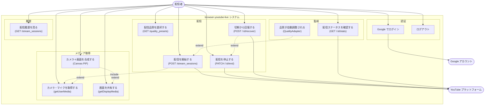

# ユースケース図（実装版）

実装済みのエンドポイント・画面をもとにしたユースケース図。

## アクター定義

| アクター | 説明 |
|---|---|
| 配信者 | ログイン済みユーザー。すべての配信操作を行う |
| Google アカウント | OAuth2 認証・トークン発行 |
| YouTube プラットフォーム | RTMP 受信・Broadcast 管理 |

## 実装済みユースケース一覧

| ID | ユースケース | 対応機能 | エンドポイント |
|---|---|---|---|
| UC01 | Google でログイン | F01 | GET /auth/google/callback |
| UC02 | ログアウト | F01 | DELETE /auth/sign_out |
| UC03 | カメラ・マイクを取得する | F02 | — (ブラウザ API) |
| UC04 | 画面を共有する | F03 | — (ブラウザ API) |
| UC05 | カメラ＋画面を合成する | F04 | — (Canvas API) |
| UC06 | 配信品質を選択する | F07 | GET /quality_presets |
| UC07 | 配信を開始する | F05 | POST /stream_sessions |
| UC08 | 配信を停止する | F06 | PATCH /stream_sessions/:id/end |
| UC09 | 切断から回復する | F10 | POST /stream_sessions/:id/recover |
| UC10 | 配信ステータスを確認する | F08 | GET /stream_sessions/:id/stats |
| UC11 | 品質が自動調整される | F09 | — (Go ブリッジ内部) |
| UC12 | 配信履歴を見る | F11 | GET /stream_sessions |
